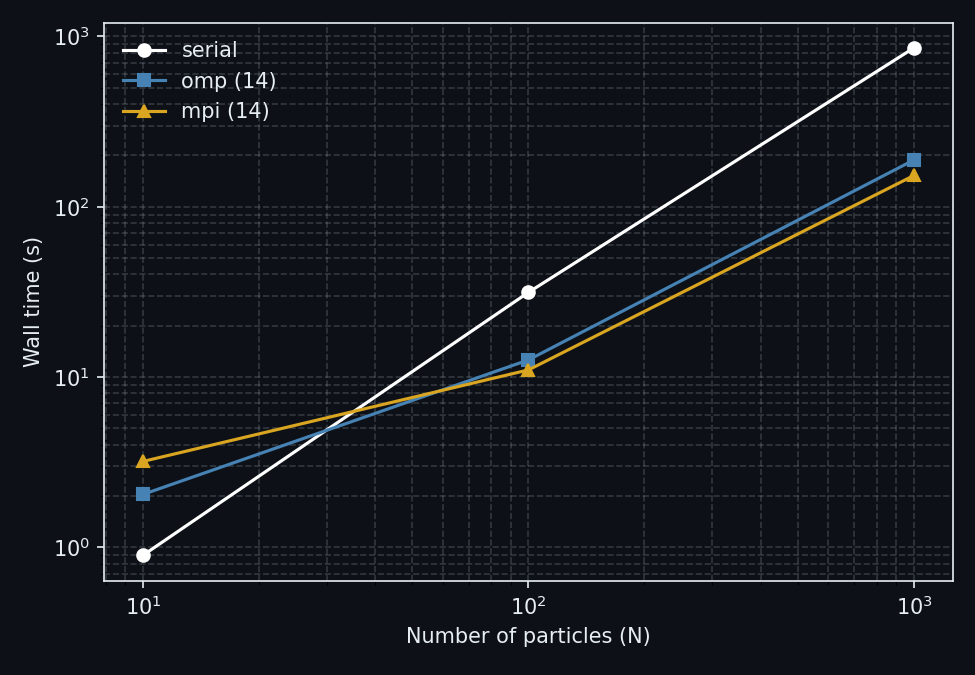

# N-Body Simulation Project

This repository implements an N-body gravitational simulation in Fortran (with small Python helpers for setup and visualization). It includes a Barnes–Hut tree implementation and several driver programs: serial, OpenMP-parallel, and MPI-distributed builds.

The simulation uses leapfrog integration to evolve N particles under Newtonian gravity.

## Project structure

- `geometry.f90` — Fortran module: 3D points, vectors and operators
- `particle.f90` — Fortran module: `particle3d` type (position, velocity, mass)
- `barnes_hut_module.f90` — Barnes–Hut tree implementation and force routines
- `main_barnes_hut.f90` — Serial / OpenMP driver (builds `nbody_bh_serial` / `nbody_bh_omp`)
- `main_barnes_hut_mpi.f90` — MPI driver (builds `nbody_bh_mpi`)
- `barnes_hut_mpi_module.f90` — MPI-oriented Barnes–Hut module (`bh_mpi_module`), works with arrays and computes forces over the local particle range per rank
- `animation.py` — Python script to visualize `output_*.dat`
- `Makefile` — Build targets: `serial`, `omp`, `mpi`, `clean`, `run`

### Data files
- `setup_*.dat` — initial configurations (`setup_random.dat`, `setup_disk.dat`, `setup_hannu.dat`)
- `output_*.dat` — simulation outputs

## Features

- Leapfrog symplectic integrator
- Barnes–Hut tree for O(N log N) approximate force calculation
- OpenMP parallelization for per-particle loops
- MPI driver that supports uneven partitions and uses `MPI_Allgatherv` to share positions

## Measured performance (disk simulation, n=500)

These timings were measured on a single node using `setup_disk.dat` (500 particles), obtaining:

| Mode | Command / runtime mode | Wall time |
|------|------------------------|-----------:|
| Serial | `./nbody_bh_serial` | 9m 7s
| OpenMP (14 threads) | `OMP_NUM_THREADS=14 ./nbody_bh_omp` | 2m 0s
| MPI (14 ranks) | `mpirun -np 14 ./nbody_bh_mpi` (OMP_NUM_THREADS=1) | 1m 31s


## Measured performance (random setup, n=500)

Timings measured on the same node using `setup_random.dat`:

| Mode | Command / runtime mode | Wall time |
|------|------------------------|-----------:|
| Serial | `./nbody_bh_serial` | 6m 17s
| OpenMP (14 threads) | `OMP_NUM_THREADS=14 ./nbody_bh_omp` | 1m 30s
| MPI (14 ranks) | `mpirun -np 14 ./nbody_bh_mpi` (OMP_NUM_THREADS=1) | 1m 14s

## Scaling

We measured the wall-clock time as a function of particle count for three configurations: serial, OpenMP (14 threads), and MPI (14 ranks), using the random setup with full parameters. The results are shown below:



- Small particle counts (N): Parallel runs can be slower than serial due to overhead.
- Moderate to large N (N ≳ 100): Parallelization provides a speedup as expected.

> **Note** This was performed on an Intel Core i7-12700H (14 cores / 20 threads)


## Build and run

Build targets via the provided `Makefile`:

```bash
# Build everything
make build

# Or build individual modes
make serial
make omp
make mpi

```

### Automated runs over all setups

You can build and run all modes (serial/OpenMP/MPI) over every input in `setups/*.dat` and store results automatically:

```bash
# Build and execute serial, OpenMP, and MPI for all setups
make run

# Customize resources
make run OMP_THREADS=8            # OpenMP thread count for run-omp
make run NP=16                    # MPI process count for run-mpi
make run OMP_THREADS=8 NP=8       # Both
```

Artifacts written by `make run`:

- Outputs per setup and mode in `outputs/`:
	- `outputs/output_<setup>_serial.dat`
	- `outputs/output_<setup>_omp.dat`
	- `outputs/output_<setup>_mpi.dat`
- Wall-clock times per setup and mode in `times/`:
	- `times/time_<setup>_serial.txt`
	- `times/time_<setup>_omp.txt`
	- `times/time_<setup>_mpi.txt`

Notes:
- `<setup>` is the base name of the file in `setups/` without the `setup_` prefix and without the `.dat` suffix (e.g. `disk`, `random`, `hannu`).
- `OMP_THREADS` defaults to the detected CPU core count (or 4 if not detectable). `NP` defaults to the same value as `OMP_THREADS`.
- By default timing uses `/usr/bin/time -f %e` to record wall time (seconds) into the corresponding file.

Individual automated targets are also available:

```bash
make run-serial                    # run all setups with the serial binary
make run-omp OMP_THREADS=8         # run all setups with OpenMP
make run-mpi NP=16                 # run all setups with MPI
```

### Manual runs (optional)

```bash
# serial (single run)
./nbody_bh_serial < setup_disk.dat

# openmp (example with 14 threads)
export OMP_NUM_THREADS=14
./nbody_bh_omp < setup_disk.dat

# mpi (example with 14 ranks, single node)
export OMP_NUM_THREADS=1
mpirun -np 14 ./nbody_bh_mpi < setup_disk.dat
```
Manual runs write `output.dat` in the working directory; the automated `make run` target renames and places these in `outputs/` with the standardized filenames listed above, and records timings in `times/`.

## Simulation parameters (in `setup_*.dat` files)

- `dt` — integration time step (e.g. `5e-5`)
- `dt_out` — output interval (e.g. `0.05`)
- `t_end` — total simulation time (e.g. `8.0`)
- `n` — number of particles (e.g. `500`)


## Dependencies

- Fortran: `gfortran` (MPI builds use `mpif90` wrapper)
- Python (optional): `numpy`, `matplotlib` for `animation.py`
